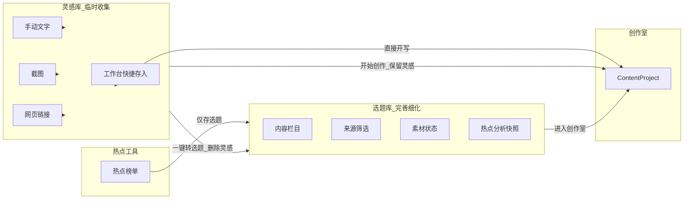

# 灵感库 / 选题库 设计说明

> **版本**：v1.2  
> **更新日期**：2026-07-07  
> **状态**：与当前 MVP 实现同步  
> **关联 PRD**：[PostCraft-PRD.md](../PostCraft-PRD.md) §4.3、§4.4

---

## 1. 设计原则

PostCraft 将内容创作前的资产整理分为三段：

| 阶段 | 模块 | 心智模型 | 职责 |
| --- | --- | --- | --- |
| 收集 | **灵感库** | Inbox（收件箱） | 临时保存文字、截图、链接等原始素材，低摩擦录入 |
| 规划 | **选题库** | Backlog（待办清单） | 完善栏目、基调、素材状态；热点分析；排期与筛选 |
| 执行 | **创作室** | Studio | 多平台生成、对话迭代、预览、草稿与发布 |

**核心约定**：灵感库只负责「先抓住」；栏目分类、来源追踪、热点沉淀均在选题库完成；最终成稿在创作室。

---

## 2. 流程总览



---

## 3. 模块职责（当前实现）

### 3.1 灵感库（`/inspirations`）

**目标**：不让碎片想法流失，作为后续选题的「原料入口」。

| 能力 | 状态 |
| --- | --- |
| 手动文字录入 | ✅ |
| 截图上传 | ✅ |
| 网页链接剪藏 | ✅ |
| 可选自由标签 | ✅ |
| 搜索、排序、导入/导出 | ✅ |
| 一键转选题 | ✅（转后从灵感库移除） |
| 开始创作 | ✅（转选题并开写：自动建 Topic 后进创作室，灵感移除） |

**明确不包含**：

- 内容栏目筛选侧栏
- 来源筛选侧栏
- 热点分析与热点收藏
- 内容栏目选择（录入时不指定栏目，转选题后在选题库维护）

### 3.2 选题库（`/topics`）

**目标**：把零散素材整理成可执行的写作任务，支撑长期选题体系。

| 能力 | 状态 |
| --- | --- |
| 新建选题（标题 + 栏目 + 基调） | ✅ |
| 左侧 **内容栏目** 筛选（含未分类） | ✅ |
| 左侧 **来源** 筛选 | ✅ |
| 已有选题 **修改栏目** | ✅ |
| 素材状态（仅想法 / 有素材 / 可开写） | ✅ |
| 热点选题 `trend_snapshot` + 热点分析弹窗 | ✅ |
| 进入创作室 | ✅ |

**热点内容唯一落点**：热点工具「存选题」写入选题库，不再写入灵感库。

### 3.3 热点工具（`/tools`）

- 分析热点、查看 AI 经营建议
- **存选题**：`POST /tools/trends/to-topic`，`source_type=trend`
- 已收藏热点 ID 从选题库 `trend_snapshot.trend_id` 聚合（`collect_saved_trend_ids`）

---

## 4. 用户路径

| 路径 | 入口 | 是否经过选题库 | 灵感库 | 说明 |
| --- | --- | --- | --- | --- |
| A | 灵感 → **一键转选题** | ✅ | 删除该条 | 推荐：先规划再写 |
| B | 灵感 → **转选题并开写** | ✅ | 删除该条 | 自动建 Topic 后进创作室 |
| C | 选题 → **进入创作室** | ✅ | — | 标准写作入口 |
| D | 工作台 Hero **直接开写** | ❌ | — | 高级捷径，已有明确方向时使用 |
| E | 热点工具 → **存选题** | ✅ | — | 热点不进灵感库 |

---

## 5. 数据模型与 API

### 5.1 Inspiration（灵感）

```text
Inspiration
+-- id
+-- content              # 原始文本
+-- source_type          # manual | screenshot | link
+-- source_url           # 链接剪藏 URL
+-- image_url            # 截图路径
+-- tags[]               # 可选自由标签（非栏目）
+-- is_highlight
+-- created_at
```

列表接口仅返回「未转选题」的活跃灵感（`list_active`：无 `topic_id` 且未被删除）。

### 5.2 Topic（选题）

```text
Topic
+-- id
+-- title
+-- content_pillar       # 内容栏目
+-- direction / tone / audience
+-- platforms[]
+-- material_status      # idea | cases | ready
+-- priority / series
+-- inspiration          # 原始灵感正文（来自转化或热点摘要）
+-- source_type          # direct | manual | screenshot | link | trend
+-- trend_snapshot       # 热点分析快照（可选）
+-- created_at / updated_at
```

`source_type` 含义：

| 值 | 含义 |
| --- | --- |
| `direct` | 在选题库表单直接创建 |
| `manual` / `screenshot` / `link` | 从灵感库转入（继承灵感来源） |
| `trend` | 从热点工具存入 |

旧数据无 `source_type` 时：有 `trend_snapshot` 视为 `trend`，否则视为 `direct`。

### 5.3 关键 API

| 方法 | 路径 | 行为 |
| --- | --- | --- |
| POST | `/inspirations/{id}/to-topic` | 创建 Topic，**删除** Inspiration |
| POST | `/inspirations/{id}/to-project` | 创建 ContentProject，**保留** Inspiration |
| POST | `/topics/{id}/to-project` | 从选题创建项目并进入创作室 |
| POST | `/tools/trends/to-topic` | 热点存选题，`source_type=trend` |
| PATCH | `/topics/{id}` | 更新栏目、素材状态等 |

### 5.4 Inspiration → Topic 字段映射

| Topic 字段 | 来源规则 |
| --- | --- |
| `title` | 灵感首行或 `trend_snapshot.title`，截断 64 字 |
| `inspiration` | 灵感 `content` 全文 |
| `content_pillar` | 灵感 `tags[0]`（若存在） |
| `source_type` | 继承灵感 `source_type` |
| `trend_snapshot` | 继承（历史遗留数据；新热点不再进灵感库） |

---

## 6. 设计合理性评估

### 6.1 合理之处

1. **职责清晰**：Inbox → Backlog → Studio 三段式符合创作者「先抓再整理再写」的心智。
2. **避免双库维护**：转选题后删除灵感，同一内容不会在两个库重复维护。
3. **热点归属选题库**：热点自带分析、栏目与排期需求，放在 backlog 比 inbox 更合适。
4. **灵感库简化**：去掉栏目/来源筛选，降低录入摩擦。

### 6.2 已知限制（Gap）

| 问题 | 说明 | 严重度 |
| --- | --- | --- |
| 开始创作绕过选题库 | `inspirationToProject` 不创建 Topic，与「最终去选题库完善」不完全一致 | 中 |
| 工作台直开写 | Hero 区 `createProject` 跳过选题库 | 低 |
| Project ↔ Topic 无关联 | 从选题进创作室后，Project 无 `topic_id`，无法回溯选题卡片 | 中 |
| 媒体元数据丢失 | 转选题仅复制文本，`image_url` / `source_url` 未写入 Topic | 中 |
| content_pillar 取自 tags[0] | 自由标签可能被误当作栏目 | 低 |
| 双按钮语义 | 「一键转选题」vs「开始创作」需文案引导 | 中 |

**结论**：整体方向合理且比改版前更清晰；主要风险是仍有捷径绕过选题库，以及 Topic 与 Project 缺少双向链接。

---

## 7. 草稿 ↔ 选题 ↔ 热点关联（v1.1，2026-07-07 实施）

### 7.1 目标

| 问题 | 方案 |
| --- | --- |
| 工作台默认直开写，跳过收集 | Hero 主按钮改为「存入灵感库」，直开写降级为「跳过规划，直接开写」 |
| 草稿无法回溯选题 | `ContentProject.topic_id` + `topic_title` + `Topic.project_id` 双向关联 |
| 同选题重复建草稿 | `topic_to_project` 若已有 `project_id` 则复用草稿 |
| 热点分析进创作室后丢失 | 拷贝 `trend_snapshot` 到 Project，AI 与 UI 共用 |
| AI 生成吃不到规划数据 | `build_creation_context_block()` 注入 pipeline |

### 7.2 数据模型扩展

```text
ContentProject
+-- topic_id: str | null
+-- topic_title: str
+-- source_type: direct | topic | inspiration | trend
+-- trend_snapshot: TrendInspirationSnapshot | null

Topic
+-- project_id: str | null
+-- status: open | writing | done
```

### 7.3 API 行为

| 入口 | source_type | 关联 |
| --- | --- | --- |
| `POST /topics/{id}/to-project` | `topic` 或 `trend` | 双向链接；复用已有草稿 |
| `POST /inspirations/{id}/to-project` | `inspiration` 或 `trend` | 拷贝 trend_snapshot |
| `POST /projects`（工作台直开写） | `direct` | 无 topic 关联 |

### 7.4 AI 上下文

`backend/app/services/creation_context.py`：

- `build_creation_context_block(project)` — 选题规划 + 热点分析块
- `platform_tip_block(project, platform)` — 各平台 `platform_tips` 注入 converter

### 7.5 UI 展示

| 页面 | 展示 |
| --- | --- |
| 工作台 Hero | 主 CTA「存入灵感库」+「已有选题」链接 |
| 草稿箱 / 工作台草稿 | `ProjectSourceBadges`：来源标签 + 选题名 |
| 创作室顶栏 | 来源标签 + 可折叠「热点分析背景」 |
| 选题库 | 已有草稿显示「继续编辑」 |

### 7.6 Phase C 实施（v1.2，2026-07-07）

| 项 | 状态 | 说明 |
| --- | --- | --- |
| 「开始创作」统一路径 | ✅ | `inspiration_to_project` 先建 Topic、删灵感，再 `_resolve_project_from_topic` |
| 媒体元数据保留 | ✅ | Topic / Project 增加 `source_url`、`image_url`，转选题时拷贝 |
| 素材状态自动流转 | ✅ | 进入创作室时 `status=writing`，`material_status: idea → ready` |
| 选题 series / priority UI | ✅ | 选题卡片内联编辑 |
| 创作室参考素材 | ✅ | 顶栏展示参考链接 / 截图 |

### 7.7 后续

| 优先级 | 项 | 说明 |
| --- | --- | --- |
| P2 | 草稿按选题分组视图 | 草稿箱二级视图 |
| P3 | Topic `status: done` 自动标记 | 草稿发布完成后回写选题 |
| P3 | 历史数据清理 | 旧 Inspiration `topic_id` 遗留记录（可选脚本） |

---

## 8. 后续优化建议（历史）

| 优先级 | 项 | 说明 |
| --- | --- | --- |
| P1 | ~~Project 关联 Topic~~ | ✅ v1.1 已实施 |
| P1 | ~~热点 snapshot 进 AI~~ | ✅ v1.1 已实施 |
| P1 | 统一「开始创作」路径 | 方案 A：先建 Topic 再进创作室；方案 B：保留捷径但 UI 标注「跳过选题规划」 |
| P2 | 转选题保留媒体元数据 | Topic 增加 `source_url` / `image_url` |
| P2 | 选题卡片 UX | 栏目/来源布局优化；补 `series`、`priority` 编辑 UI |
| P3 | 历史数据清理 | 旧 Inspiration `topic_id` 遗留记录（可选脚本） |

---

## 9. 相关代码

| 区域 | 路径 |
| --- | --- |
| 灵感库页 | `frontend/src/app/inspirations/page.tsx` |
| 选题库页 | `frontend/src/app/topics/page.tsx` |
| 热点工具页 | `frontend/src/app/tools/page.tsx` |
| 灵感 / 选题 API | `backend/app/routers/api.py` |
| 热点 API | `backend/app/routers/tools.py` |
| 数据模型 | `backend/app/models/schemas.py` |
| 创作上下文 | `backend/app/services/creation_context.py` |
| 来源标签组件 | `frontend/src/components/content/ProjectSourceBadges.tsx` |
